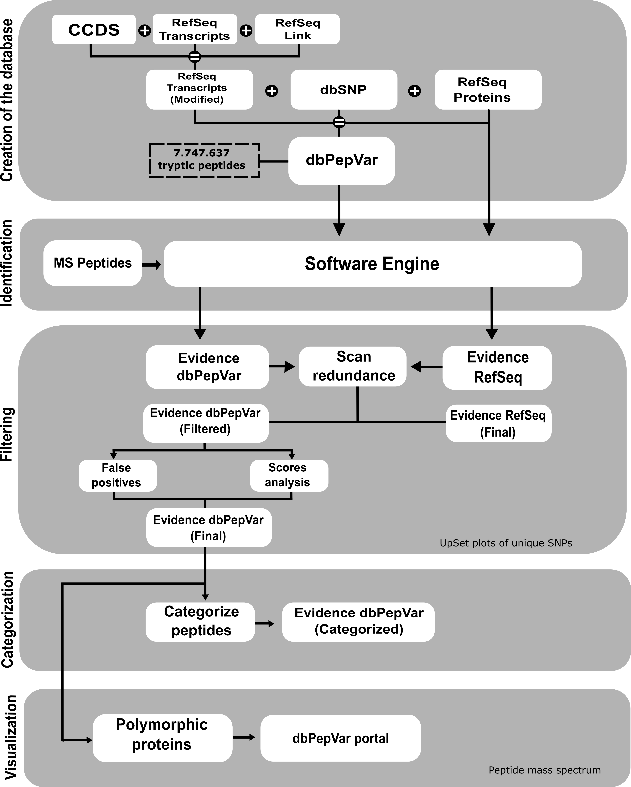
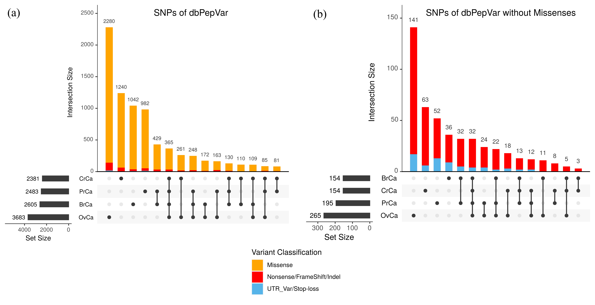
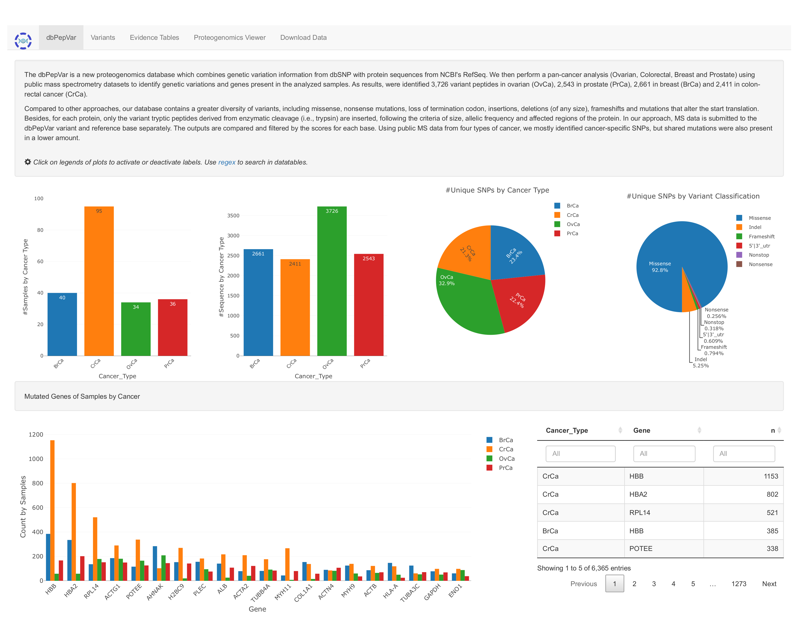
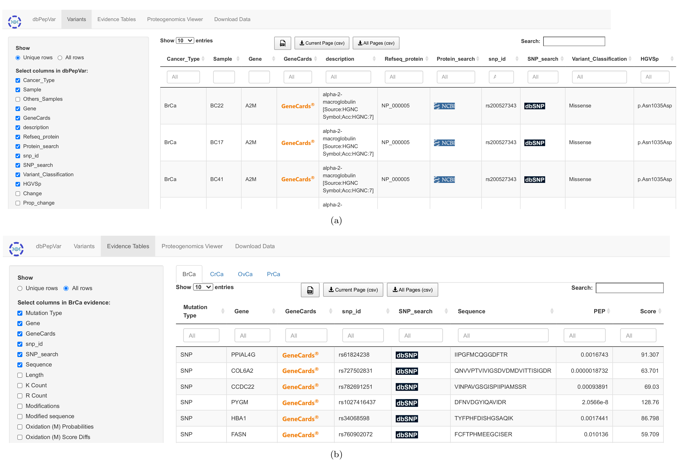

## Welcome to dbPepVar

The dbPepVar is a new proteogenomics database which combines genetic variation information from dbSNP with protein sequences from NCBI's RefSeq. We then perform a pan-cancer analysis (Ovarian, Colorectal, Breast and Prostate) using public mass spectrometry datasets to identify genetic variations and genes present in the analyzed samples. As results, were identified 5,449 variant peptides in ovarian (OvCa), 2,722 in prostate (PrCa), 2,392 in breast (BrCa) and 3,061 in colon-rectal cancer (CrCa).

Compared to other approaches, our database contains a greater diversity of variants, including missense, nonsense mutations, loss of termination codon, insertions, deletions (of any size), frameshifts and mutations that alter the start translation. Besides, for each protein, only the variant tryptic peptides derived from enzymatic cleavage (i.e., trypsin) are inserted, following the criteria of size, allelic frequency and affected regions of the protein. In our approach, MS data is submitted to the dbPepVar variant and reference base separately. The outputs are compared and filtered by the scores for each base. Using public MS data from four types of cancer, we mostly identified cancer-specific SNPs, but shared mutations were also present in a lower amount.

The dbPepVar is available at: <https://bioinfo.imd.ufrn.br/dbPepVar/>.

**Figure 1. Workflow of dbPepVar creation and the analysis of the results**. **Database creation step**: The first step consists of generating a multi-fasta transcript file containing information about the position of the beginning of the reading frame, the transcript identifier, and the reference protein. This information was obtained from CCDS (Consensus Coding Sequence) and RefSeq Link files, which contain the association between CCDS identifiers, Refseq protein, and transcribed RefSeq. The modified transcript Refseq was used to generate the sequences with frameshift and stop-loss mutations. The dbPepVar integrates peptides information, types of mutations, and transcripts data from RefSeq proteins and dbSNP. **Peptide identification step**: The search process uses each base individually (dbPepVar and RefSeq) to identify the peptides. **Filtering step**: In this step, the identified peptides are checked in both bases (dbPepVar and RefSeq) and verified if they have the same MS spectrum. In a redundancy case, the variant peptide with a higher score was kept. The variant peptides with scores less than 50 and false positives were removed. The false positives are the variant peptides with enzymatic cleavage error whose position differs from the reference protein. **Classification step**: In this step, variant peptides are classified according to the type of mutation. **Visualization step**: In the last step, the evidence tables of each cancer analyzed are available at the portal dbPepVar, and the data is integrated with the mass spectra visualization tool, Proteogenomics Viewer.

**Figure 2. Intersection size of Variant Classification by Cancers.** Variant distribution by sample typesand frequency of unique and shared variants from dbPepVar found in ovary (OvCa), prostate (PrCa), breast (BrCa) and colorectal (CrCa) cancer samples. The vertical bars show the number of identified variants for each sample combination, which is indicated by the vertical line and dots in the lower portion of the figure. **(a)** Data where missense mutations (orange) are considered. **(b)** Missense mutations are removed from the data, red bars indicate indel observations and blue bars indicate UTR and stop loss mutations.

**Figure 3. The dbPepVar portal.** Main Page - View of initial page containing the summary information of the samples, peptide sequences, and unique polymorphisms.

**Figure 4. Variant and Evidence menus.** **(a)** The variant menu presents a table with 27 filterable columns to describe each mutation, 11 of which are shown by default. **(b)** The evidences menu has the actual data used to extract information available at dbPepVar. The parsed data is shown in tabulated format and can be filtered by users through 75 columns, eight of which are presented by default.

### Citation:

LM Cunha, PCA Terrematte, TS Fiúza, VL Silva, JE Kroll, SJ de Souza, GA de Souza. (2022) "dbPepVar: a novel cancer proteogenomics database". To be published.

### Authors:

-   Lucas Marques da Cunha¹
-   Patrick Cesar A. Terrematte¹,
-   Tayná da Silva Fiúza¹,
-   Vandeclécio L. da Silva¹,
-   José Eduardo Kroll¹,
-   Sandro José de Souza¹,²,
-   Gustavo Antônio de Souza¹,³,

### Affiliations:

¹ Bioinformatics Multidisciplinary Environment - UFRN,  
² Brain Institute - UFRN.  
³ Department of Biochemistry - UFRN
